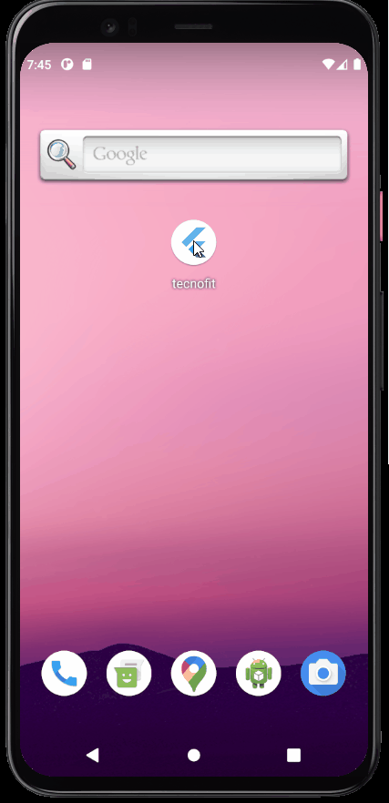

# Tecnofit Challenge App - [](https://flutter.dev/)

<h1 align="center">
  <p>🏋️‍♂️A simple Login App🏋️‍♂️</p>
  
</h1>

# Features

- Loading screen to check if user has already logged in
- Checking fields in login screen
- Keep user logged using shared preferences
- Logout button in home page

## Getting Started

- Clone the repository
- run in cmd:
  ```cmd
  flutter pub get
  flutter run
  ```

## Dependencieis

| Lib                   | Link                                                                 |
| --------------------- | -------------------------------------------------------------------- |
| shared_preferences    | [Shared Preferences](https://pub.dev/packages/flutter_native_splash) |
| flutter_native_splash | [Splash Screen](https://pub.dev/packages/flutter_native_splash)      |
| http                  | [Http requests](https://pub.dev/packages/http)                       |

## Device

- Tested in Pixel 5 - Android 11
